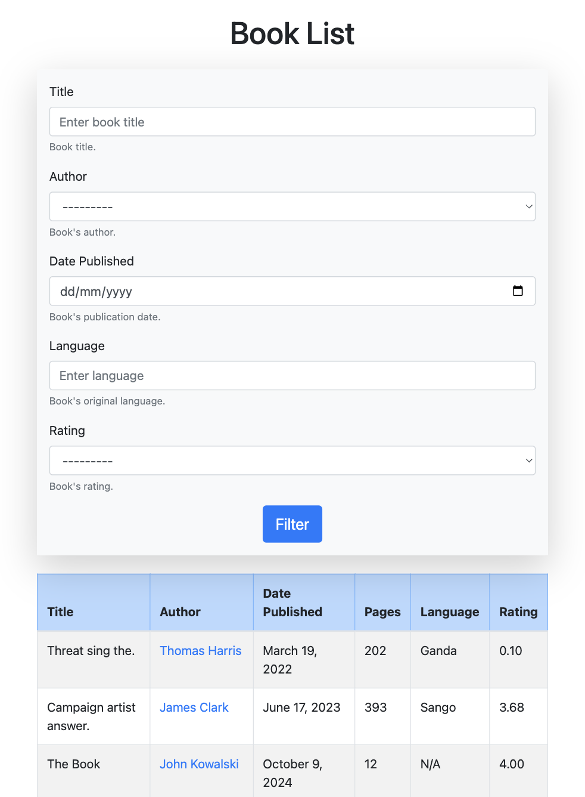
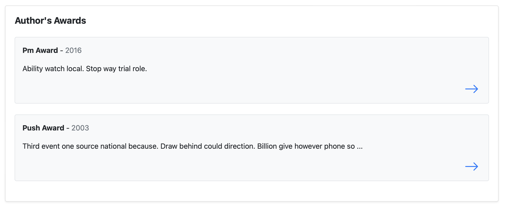
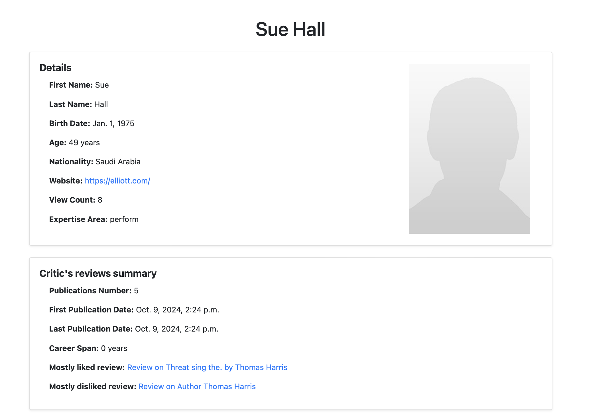
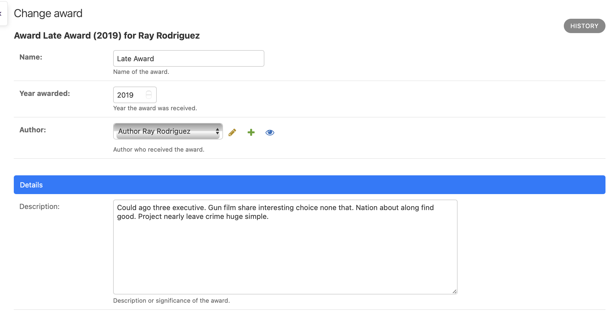

---
export_on_save:
    puppeteer: ["pdf"]

puppeteer:
  format: "A4"
  margin: 
    top: "2cm"
    bottom: "2cm"
    right: "1.5cm"
    left: "1.5cm"
  scale: 0.9
  displayHeaderFooter: true
  headerTemplate: |
    <div style="width: 100%; font-size: 10px; padding: 0 1.5cm; box-sizing: border-box;">
      <span style="float: left;">"The Imperial Book Database" Raport</span>
      <span style="float: right;">by Paweł Pozorski</span>
    </div>
  footerTemplate: |
    <div style="font-size: 10px; width: 100%; text-align: center;">
      Page <span class="pageNumber"></span> of <span class="totalPages"></span>
    </div>
---

<p style="text-align: center;">
    Web Application Programming
    <br>
    Faculty of Mathematics and Information Science
    <br> 
    Warsaw University of Technology 
    </p>
<p style="text-align: center;">
    <i>Paweł Pozorski gr 4</i>
    <br/>
    <i>11.10.2024</i>
</p>


# Overview

The following raport is meant to describe "The Imperial Book Database", a django-based web application following modern web programming trends. 

It's main purpose is to serve users book reviews in a simple, not disturbing format, allowing them to focus on website content rather than eye-catching state-of-the art dynamic components. Thanks to multiple filtering options, one can search for their favorite book and later explore it's reviews or deeapen their knowledge about author and his / hers other creations and awards.

For technical detail, it uses django python library as a backend also serving front-end .html files generated via django's jinja-based template engine. It's designed to remain as efficient as possible, allowing for serving content to many users concurently without extensive server-unkeep bills. Therefore, much effort was put to create objects following best sql-related practices, including creating indexes. To guarantee site stability, entire project is seperated into 5 independent apps, each one has a 100% coverage in unitests and serves different purpose.

# Project Requirements

The following reqirements were requested: 

- allow users login and password reset
- there are a normal user, manager and backend admin roles 
- the application allows only the logged-in user to access restricted resources
- at least 2 tables with items browsable by the regular user, which can be filtered 
- the application is aesthetically pleasing 
- the application is responsive (i.e. adapted to at least two resolutions - e.g. computer and tablet or computer and smartphone)
- all forms data is validated
- the application allows you to save or modify records
- use of AJAX technology or similar technique
- The application follow good programming practices
- The application has no difficulty in deployment on a separate machine
- Automatic tests
- short report with idea outline, dataflow and main views screenshots
- source codes

In the following examples, besides project usage documentation, the proof of their complition will be given.

# Documentation

## Data Flow

Please keep in mind that even though the following chart looks compilcated, many of these classes are django system - defined classes for managing admin theme, action's history and more. 
Classes holding accual buiseness data are Reaction, Review, CustomUser, Critic, Author, Award and Book.

<p align="center">
  
  <em><i>Application's data from.</i></em>
</p>

## Home page

Here is short project description with url link leading to [contact](#contact-page), incouraging users to share their thaughts and complains with website admins.

Underneath them there is a card with links to main content subpages, which are [books page](#books-list-page), [authors page](#authors-list-page) and [critics page](#critics-list-page) with short encouraging description and stats on number of objects avaliable in the database. Please note that database that will be deployed in provided .Dockerfile will have different amount of auto-generated, meaningless objects just to create simple website demo.

Website header is also straight-forward, with url links to all user-reachable subpages.

<p align="center">
  
  <em><i>Home Page for unauthorised user. There are login and signup options. Profile and logout are hidden.</i></em>
</p>
<p align="center">
  
  <em><i>Home Page for normal user.</i></em>
</p>
<p align="center">
  
  <em><i>Home Page for admin user. As he can access manager panel, link for it is displayed as well.</i></em>
</p>
<p align="center">
  
  <em><i>Home Page for admin user. As he can access admin panel, link for it is displayed as well.</i></em>
</p>

## Contact Page

It allows to contact the website admins. If all fields get validated (restrictions are showed in smaller font under input fields), the mail will be set to predefined email address with filled in data. For simplicity of deployment and due to lack of sfmtp, for now these info will be just printed to a console.

<p align="center">
  
  <em><i>Contact Page with simple form.</i></em>
</p>

## About Page

It is meant to familiarise the consumer with project's idea and goals.

<p align="center">
  
  <em><i>About Page with 3 seperate cards serving project's related informations.</i></em>
</p>

## Profile Page

Here user can govern his/hers profile and check personal data.

<p align="center">
  
  <em><i>User Profile Page card. On the bottom 3 options are available, presented on following photos.</i></em>
</p>
<p align="center">
  
  <em><i>Update profile card, with all user editorable fields available for change. Please note that after that user's 'Last profile update date' will be updated as well.</i></em>
</p>
<p align="center">
  
  <em><i>Set new password form. All password restrictions are shown.</i></em>
</p>
<p align="center">
  
  <em><i>Page after successful user's password update. Pay attention to success comunicate and updates user's account update date.</i></em>
</p>
<p align="center">
  
  <em><i>Confirm account removal pop-up.</i></em>
</p>

## Objects Pages

As they have following structure, only one is described below.

### Book List Page

It shows the table of all database's books available. If more than 10 books are stored, they will be presented in a pagination table. On the top filtering options are available. Books are listed in popularity-descending-order, where book with most views gets popularity of 10, and with no views - 0.

Table's rows are buttons redirecting to corresponding object's details subpages. If any of cells have a blue - hyperlink - text, it also leads to this cell's corresponding object's details subpage.

<p align="center">
  
  <em><i>Books list page with its form and content table.</i></em>
</p>

### Authors List Page

<p align="center">
  
  <em><i>Authors list page with its form and content table.</i></em>
</p>

### Critics List Page

<p align="center">
  
  <em><i>Critics list page with its form and content table.</i></em>
</p>

## Object's Detail Pages

### Book Page

Represents all information available about the book of choice. Object's reviews are forbidden for unauthorized user access. Below mentioned likes are created via api calls using js and jQuery, they update dynamically (after logged user action), without the need of refreshing.

<p align="center">
  
  <em><i>Basic info. Pay attention to metrics of "view count", "reviews count". To the right - book's default photo, displayed if manager creating this entry did not provided one.</i></em>
</p>
<p align="center">
  
  <em><i>Summary card. Represented by text field, so summary can be as long as it is needed.</i></em>
</p>
<p align="center">
  
  <em><i>Reviews Card. Each review has its author name with a hyperlink to his/hers detail subpage, star - if given - and a like and dislike count. Reviews are ordered (starred, net like count = likes - dislikes, -likes). If currently logged user has reacted to a review, his reaction is indicated by filled-in circle as 2 first on the picture.</i></em>
</p>
<p align="center">
  
  <em><i>Review card for unauthorised user.</i></em>
</p>
<p align="center">
  
  <em><i>Example filter usage.</i></em>
</p>

### Author Page

Besides to cards common with book page - such as Details and summary (displayed as short story), author can recieve rewards. If they have one, their 'awards-stats' will be displayed as well. Some statistic are also calculated for their publication, displayed in different card. Same as in book (and later in Critic), if no author's photo is provided, default will be displayed.

<p align="center">
  
  <em><i>Authors publications statistic. Career span is date difference between last and first publication.</i></em>
</p>
<p align="center">
  
  <em><i>Authors awards statistic.</i></em>
</p>
<p align="center">
  
  <em><i>Authors awards with short description. Arrow on the right is a botton redirecting to award's detail page.</i></em>
</p>
<p align="center">
  
  <em><i>If no data is available, user will be notified. Awards are also restricted only to authorised users.</i></em>
</p>

### Award Page

<p align="center">
  
  <em><i>Award page with default award images/image. It has back-leading hyperlink to reciever - either Author or Critic</i></em>
</p>

### Critic Page

<p align="center">
  
  <em><i>Top of the Critic page. If he/she is dead, insted of age the death date will be displayed (same goes for Author). </i></em>
</p>
<p align="center">
  
  <em><i>Critic's reviews. We can easily see waether it is about book (and its author) or just about author, with hyperlink to corresponding detail page.</i></em>
</p>

## Manager Panel

It is a highly customized django admin panel. Allows for creation of all objects, their deletion and modification. Manager can also view more system-based fields than are normally displayed to user (like objects creation date or who lastly modified it).

<p align="center">
  
  <em><i>Awards management. Manager can easily filter and order awards from there.</i></em>
</p>
<p align="center">
  
  <em><i>Awards change view. Manager can update editable object's fields from here. Some of read-only fields are in System section, that is by default closed.</i></em>
</p>
<p align="center">
  
  <em><i>System read-only fields. Applicable to all of used models.</i></em>
</p>
<p align="center">
  
  <em><i>Author's list. Manager can reset author's view count via custom action</i></em>
</p>
<p align="center">
  
  <em><i>Reviews's list. Manager can easily star and unstar it via custom action</i></em>
</p>

## Admin Panel

Admin can also can view all users and deactivate selected one. Being admin does not means being manager.

Superadmin is a website super-admin with full access to its customization and users. Can delete them or change their roles. No role is more powerful than that. He can also add custom groups and assign them permission, then give them to selected users. Only one is created by default by django.

<p align="center">
  
  <em><i>Staff - manager group - permissions view from super admin panel. Accessible only for admins.</i></em>
</p>


# Technical Appendix

## Deploying

### Using docker

```bash
# in the same dir as readme
docker build -t "book-shop" .
docker run -p 8000:8000 "book-shop"   
```

### Natively

```bash

# in the same dir as readme
pip install -r requirements.txt

# in book_shop home dir (one with manager.py)
# python manage.py makemigrations
python manage.py migrate
python manage.py collectstatic

echo "from django.contrib.auth import get_user_model; \
User = get_user_model(); \
User.objects.filter(username='admin').exists() or \
User.objects.create_superuser('admin', 'admin@example.com', 'admin', first_name='admin', last_name='admin')" \
| python manage.py shell

python manage.py shell < book_shop/generate_examples.py
gunicorn --timeout 120 --workers 2 --threads 3 --bind 0.0.0.0:8000 book_shop.wsgi:application"             
```

## Tests

For each app there is a set of tests defined, checking weather access restrictions, forms validation, models restrictions, views behaviour and many more works propertly. To launch them you need to run <code>python manage.py test</code> command in project root directory. This will yield following response:

```bash
book_shop % python manage.py test     
Found 122 test(s).
Creating test database for alias 'default'...
Group "Staff" created successfully.
Group "Admin" created successfully.
System check identified no issues (0 silenced).
..........................................................................................................................
----------------------------------------------------------------------
Ran 122 tests in 8.115s

OK
Destroying test database for alias 'default'...
```

## Database and static content serving

For example purposes we use django's build-in database, but it's pretty straightforward to replace it with any - also remote - sql database provider. For same reason we run server with <code>--insecure</code> option, as it also serves static and media files (that again, can be easily migrated to remote provider).

## Support for no-pc devices

Thanks to bootstrap and jQuery, my app remains pretty and responsive regardless to device resolution.

<p align="center">
  
  <em><i>Profile page on IPhone-SE simulated by Google Chrome.</i></em>
</p>
<p align="center">
  
  <em><i>Admin page on Ipad Air simulated by Google Chrome.</i></em>
</p>
